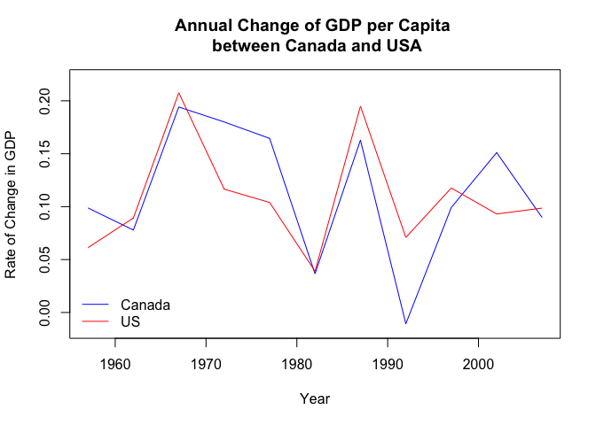
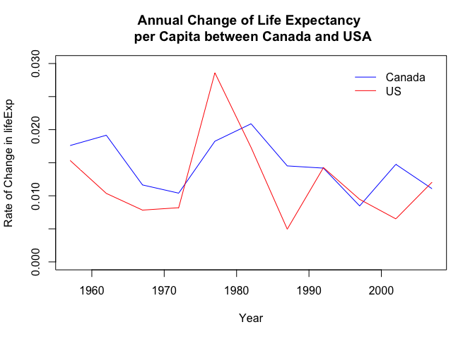
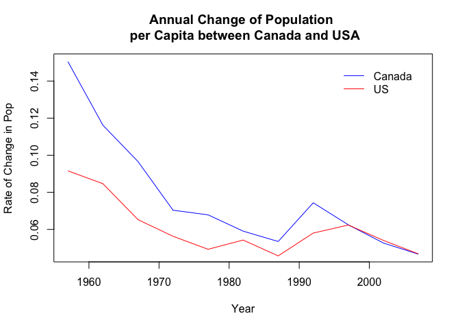

# Seminar 1: Country Rate Comparisons


## Set Up

We will be using the Gapminder dataset to compare two countries based on their life expectancy (lifeExp), GDP per capita (gdpPercap), and population (pop). The countries of interest include Canada and the United States. We will specifically be comparing the rate of change of the above country metrics against time (year). 


```r
# installing and loading the gapminder dataset
install.packages('gapminder', repos = 'http://cran.us.r-project.org')
library(gapminder)
library(data.table)
library(dplyr)
```


```r
# function to compute the rate of change for each metric
deltaCompute <- function(x)
{
  x.lag <- Hmisc::Lag(x) 
  x.diff <- x - x.lag
  x.delta <- x.diff/x.lag
  
  return(x.delta)
}

# specify the variables of interest in our dataset 
countries <- c('Canada','United States')
metrics <- c("lifeExp","pop","gdpPercap")
info <- c('country','year')

# extract data fromt he gapminder dataset
for (i in 1:length(countries)) {
  # create a name for the subset
  subsetName <- paste('dat.',countries[i],sep = "")
  # extract fields of interest 
  selectFields <- gapminder[gapminder$country==countries[i],c(info,metrics)]
  # assign fields to subset
  assign(subsetName, value=selectFields)
}

# calculate rate of change of metrics and add to subsets
can.metric <- matrix(NA, nrow = nrow(dat.Canada), ncol = length(metrics))
us.metric <- matrix(NA, nrow = nrow(`dat.United States`), ncol = length(metrics))
for (i in 1:length(countries)) {
  for (j in 1:length(metrics)) {
    # calculte rate
    delt <- eval(as.name(paste('dat.',countries[i],sep="")))[,metrics[j]] %>%
      as.matrix %>%
      as.numeric() %>%
      deltaCompute()
    # add as new field in subset 
    if (countries[i]=='Canada') {
      can.metric[,j]<-delt
    } else {
      us.metric[,j]<-delt
    }
  }
}

# combine calculated fields with subset 
colnames(can.metric) <- paste('delt', metrics, sep ='_')
colnames(us.metric) <- paste('delt', metrics, sep ='_')
dat.can.delt <- data.frame(dat.Canada, can.metric)
dat.us.delt <- data.frame(`dat.United States`, us.metric)
```

## Plots
After creating and extracting necessary fields, we can now plot comparisons between Canada and the United States. 


With economic recessions in both countries during 1982 and the 1990s, we can see large dips in the rate of change in GDP during those periods. 

<!-- -->

Life expectancy in the US increased dramatically in 1977 before plumetting back down in 1982 and reaching an all time low in 1987 (between the 1950s - 2000s). Canada showed a similar growth and decline, but was much
more stable in its life expectancy across the same years. The spike in US life expectancy rates may have been because the Vietnam war had ended during that time, however shortly after a recession had fallen over the United States which may explain the consequent drop in life expectancy. 

<!-- -->

We can see similar effects in life expectancy reflected on the population growth rates. After a large drop in life expectancy and therefore population in the 1980s, a growth can be seen in both Canada and the USA in the 1990s. 

<!-- -->


